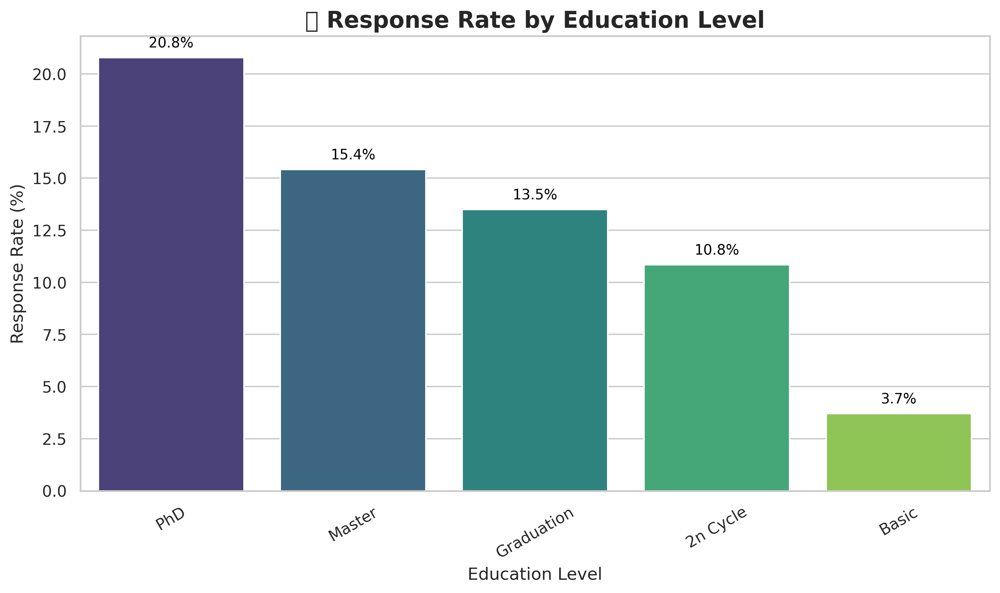
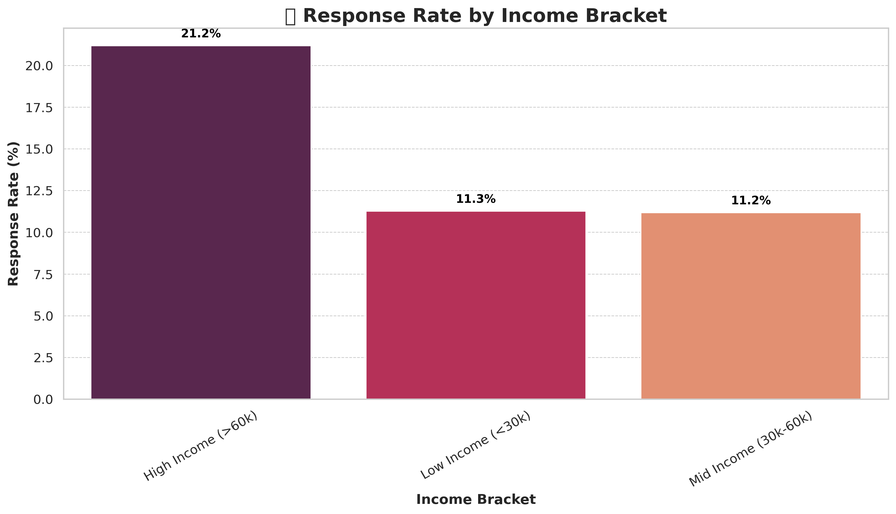
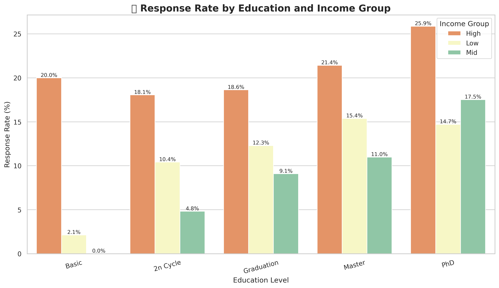

# 🍷 Marketing Campaign Dashboard: Wine Retailer Campaign Analysis

This data storytelling project explores how customer demographics, behavior, and preferences influence responses to a wine retailer's marketing campaign. The analysis is conducted using SQL for data querying and Python for visualization (via Google Colab). The goal is to uncover actionable marketing insights and build an interactive dashboard framework.

---

## 🚀 Project Objectives

- Analyze customer response rates by **demographic** and **behavioral segments**
- Identify **high-performing customer segments** for targeted marketing
- Visualize trends in product preference, income brackets, age, and education
- Use storytelling dashboards to communicate results to stakeholders

---

## 🛠 Tools & Technologies

| Tool        | Purpose                          |
|-------------|----------------------------------|
| SQLite      | Querying and filtering customer data |
| Pandas      | Data manipulation and analysis   |
| Seaborn / Matplotlib | Data visualization        |
| Google Colab| Notebook-based storytelling and dashboarding |
| Git / GitHub| Version control and portfolio publishing |

---

## 📂 Project Structure

```
marketing-campaign-dashboard/
├── data/                         # Cleaned CSV data and query result tables
├── notebooks/
│   ├── q1_visuals.ipynb          # Response by education
│   ├── q2_visuals.ipynb          # Response by income
│   ├── q3_visuals.ipynb          # Wine spending vs. response
│   ├── q4_visuals.ipynb          # Web purchases vs. response
│   ├── q5_visuals.ipynb          # High spenders who responded
│   └── q6_visuals.ipynb          # Response by education and income
├── sql/
│   └── q1_response_by_education.sql  # SQL code blocks (follows notebook order)
├── visuals/
│   ├── avg_wine_vs_web_purchases_by_education.png
│   ├── response_by_education_and_income.png
│   ├── response_rate_by_education.png
│   ├── response_rate_by_income.png
│   ├── web_purchasers_vs_response.png
│   └── wine_spending_vs_response.png
└── README.md
```


---

## 📈 Key Visuals & Insights

### 1. **Response Rate by Education**

> Customers with **PhDs and Master’s degrees** show the highest campaign engagement.

---

### 2. **Income vs Response**

> Customers in the **high income bracket** are significantly more responsive.


### 3. **Response by Education and Income**

> **PhD and Master's degree holders** respond highest across income levels.
---

## 🧠 Business Recommendations

- 📌 **Target high-income, educated customers** with tailored campaigns.
- 📨 Test campaign timing and message personalization **across edu segments** because high income individuasl are present across edu levels.

---

## ✅ How to Use This Repo

1. Clone the repo or open notebooks in [Google Colab](https://colab.research.google.com/)
2. Upload the `marketing_campaign_cleaned.csv` file (from `data/`)
3. Run the notebooks to recreate the visual analyses
4. Use SQL scripts in `sql/` to run your own segment-level queries

---

## 💼 About the Author

**Data-Matt.**  
Aspiring Data Analyst with strong SQL + Python skills. MBA focused on data storytelling and business impact.  
🔗 [Portfolio](https://github.com/Data-Matt0) | ✉️ [Email](mailto:matt@realtech.one) | [LinkedIn](https://www.linkedin.com/in/matt-burkhart-mba/)

---

## 📌 License

This project is open-source under the MIT License.

